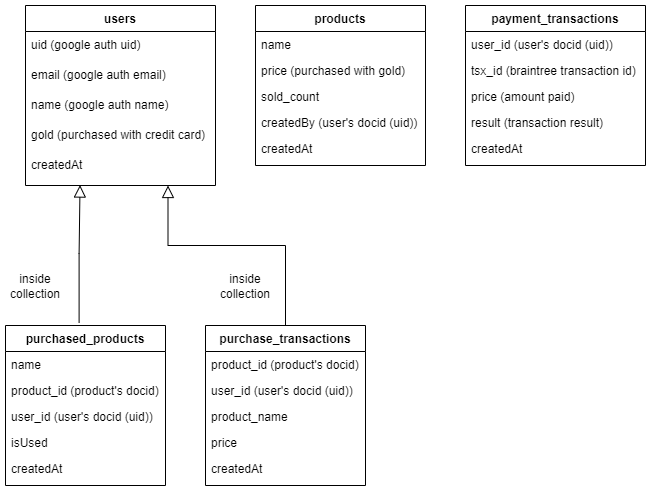

# Game Services

## Service Details

1. **userService**
   - It is the service that retrieves the user's data.
     
2. **productService**
   - These are services that bring in-game products and add in-game products.

3. **purchaseService**
   - It is a service that allows purchasing in-game products, increases the quantity sold, assigns them to the user and creates a product transaction record for these transactions.

4. **paymentService**
   - It is a service where the user can buy gold with a credit card and creates a payment transaction record for these transactions.

## Sistem Mimarisi, Güvenlik ve Ölçeklenebilirlik

1. **All Services Run On Firebase Cloud Functions**
   - All backend functions of the project were built and served using Firebase Cloud Functions.

2. **Firebase Google Sign-In Used for Registration and Login**
   - Firebase Google Sign-In integration was made so that users can register and log in quickly and securely.

3. **Database Records Atomicized Using Firestore Batch**
   - Multiple records made in Firestore were atomicized using Firestore Batch.

4. **Firestore Production Rules Customized**
   - Firestore security rules are customized to ensure that only logged in users have access to data.

5. **Services Opened to Access with Firebase onCall Functions**
   - Services were made accessible with Firebase Client SDK and automatic verification was provided with Firebase Authentication.

6. **Firestore and Firebase Functions and Triggers Deployed to the Same Region**
   - All Firestore and Firebase functions and triggers were deployed in the same region (Frankfurt).

7. **Braintree Gateway access was achieved by authenticating with Firebase Authentication**
   - Users who will make payments are given access to the Gateway with Firebase Authentication verification using Firebase Function.

## Trigger Services

1. **createUserTrigger**
   - Created a trigger that automatically creates a Firestore document when the user logs in for the first time.

2. **paymentTransactionTrigger**
   - A trigger was created that automatically triggered after the payment process and logged the transactions.

## Database Schema

---

## Used Technologies

- **Firebase Cloud Functions**
- **Firebase Firestore**
- **Firebase Authentication**
- **Firebase Google Sign-In**
- **Node.js**
- **Express.js**
- **Braintree Sandbox**
- **PayPal**

## Usage

    - run it with "npm start" from the web directory's terminal
